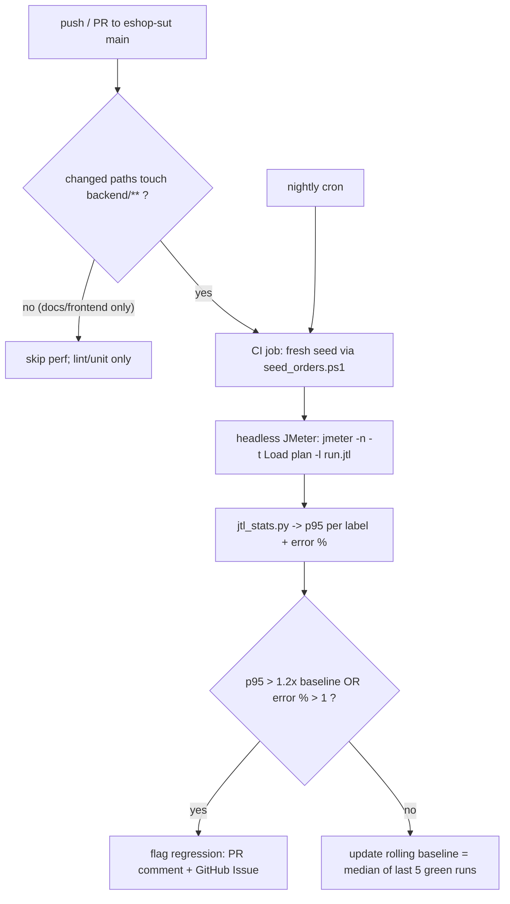

# HW05 Performance Testing Report
- Student: <name — fill in> · SID: 23127047 · SUT: EShop (backend API, `http://localhost:3000`) · Tool: JMeter 5.6.3 · Date: 20260830

## 1. Test Design

### 1.1 Endpoint map & workflow
Sources: kb/spec.md + kb/api_specification.md, verified live on 2026-08-30.

**Workflow 4 — Admin Order Fulfillment** (team-assigned; non-duplication: other group members handle other workflows). Goal: DB load tolerance when the admin lists, inspects and transitions many orders concurrently.

| # | Group | Endpoint | Method | Auth | Data source | Verified live |
|---|---|---|---|---|---|---|
| 1 | Auth-heavy | `/api/login` | POST | — (returns JWT) | `jmeter/data/users.csv` (admin@eshop.com) | ✅ 200 + JWT |
| 2 | Read-heavy | `/api/admin/orders` | GET | `Authorization: Bearer <token>` | token extracted from #1 | ✅ 200, 8→242 orders |
| 3 | Read-heavy | `/api/orders/:id` | GET | Bearer | `jmeter/data/orders.csv` (pending order ids) | ✅ 200 |
| 4 | Transactional | `/api/admin/orders/:id/status` | PUT | Bearer | `orders.csv` — body `{"status":"confirmed"}` | ✅ 200, persisted |

**Session mechanics.** Single admin account (`admin@eshop.com`). Login returns JWT, extracted by JSON Post-Processor (`$.token`) and injected via HTTP Header Manager (`Authorization: Bearer ${token}`).

**Lockout behaviour & reset.** FR-02: 3 consecutive failed logins lock the account for 30 s. Mitigation: one correct credential row (no invalid-password traffic), login content assertion ("token" in body) makes any lockout immediately visible in results, and between official runs the account is verified unlocked with one manual login (documented in §2).

**Per-group justification.** Auth-heavy: every iteration re-authenticates (JWT issuance cost + the lockout counter under concurrency). Read-heavy: system-wide order list + per-order detail = the two queries an admin console hammers. Transactional: state-machine transition `pending → confirmed` is a write path with validation, matching the workflow goal of bulk order processing.

**Data strategy (one-way state machine).** Transitions are one-way, so each run consumes pending orders. `jmeter/scripts/seed_orders.ps1` creates fresh pending orders via the real cart/checkout flow and rewrites `orders.csv`; the Load plan uses `recycle=false, stopThread=true` so a thread stops rather than hitting an already-consumed id. Data is re-seeded + CSV re-exported immediately before every official run.

**⚠️ kb ↔ live mismatches / bug candidates** (not adjusted in kb):
1. **FR-08 violation — client-supplied `total_amount` accepted.** Checkout was called with `total_amount: 0` while the cart held a 30,000,000 ₫ item; the order was stored with `total_amount = 0`. Spec: "Backend phải tự tính lại tổng tiền; không chấp nhận giá trị `total_amount` do client gửi lên."
2. **SEC-01 related — login response leaks the full user record**, including `password` (appears plaintext: `"password":"Admin123!"`), `login_attempts`, `locked_until`. Spec requires passwords never stored/exposed as plaintext.

### 1.2 Load profiles

All three plans share the identical workflow (samplers, CSVs, extractors, assertions, think time); they differ ONLY in Thread Group + listener (R2).

| Plan | Threads | Ramp-up | Duration/loops | Listener (R4) |
|---|---|---|---|---|
| Load | 20 | 10 s | 5 loops (~25 s) | Aggregate Report |
| Stress | 60 | 10 s | 6 loops (~30 s) | Summary Report |
| Spike | 80 | 1 s | 1 loop (~4 s burst) | View Results Tree |

Justifications:
- **Load 20 threads / 10 s ramp / 5 loops** — moderate concurrency for a single-process Node+SQLite SUT; ramp shortened from the AI's 60 s to 10 s on human review so thread lifetime (~18 s) exceeds ramp-up (otherwise peak concurrency caps at ~6); 5 loops = exactly 100 samples per sampler.
- **Stress 60 threads / 10 s ramp / 6 loops** — 3× Load to push the latency knee; ramp 10 + loops 6 keeps lifetime (~20 s) above ramp so all 60 threads overlap; 360 PUTs consumed → seed 400.
- **Spike 80 threads / 1 s ramp / 1 loop** — near-instant burst of 80 concurrent admins; 80 PUTs → seed 100.
- **Think time 800 ms** everywhere — realistic admin pause (~3.3 s/iteration).
- **Plan files:** `jmeter/plans/23127047_{Load,Stress,Spike}_20260830.jmx`

### 1.3 Human review — what the AI got wrong

| # | What was wrong | Impact | Fix | Why AI missed it |
|---|---|---|---|---|
| 1 | CSV Data Set Configs generated with `ignoreFirstLine=false` while headers were present and `variableNames` set — header row consumed as data | Every other iteration sent `email=email, password=password` → ~50% false 401s; orders header also produced a bogus `/api/orders/order_id` request | Set `ignoreFirstLine=true` in both CSV configs; re-verified: 0% login errors | Endpoint characteristic (CSV semantics) + model assumption that header rows are always skipped; caught by smoke run + response-body trace before any official run |
| 2 | Initial orders.csv was generated once at design time and reused across runs despite the one-way state machine | Stale confirmed ids → 400 "invalid transition" errors (50% PUT failures in a validation run) | Seed script now rewrites `orders.csv` on every re-seed; re-seed + re-export before each official run | Model did not track state consumption across repeated runs (no memory of data lifecycle between invocations) |
| 3 | Stress profile generated as ramp 30 s / 3 loops — thread lifetime (~10 s) shorter than ramp-up | Peak concurrency would cap at ~21 of 60 threads; the "stress" would have measured a trickle, not 60 concurrent admins | Ramp 10 s / loops 6 (lifetime ~20 s > ramp); verified 60/60 active threads in the run log | Same ramp-vs-lifetime arithmetic the model missed on Load; template numbers reused without recomputing lifetime |

## 2. Test Execution

All runs executed in the JMeter GUI on 2026-08-30/31 against the live SUT; each preceded by a re-seed (`seed_orders.ps1`) and one manual unlock-check login. **No lockout ever triggered** (single valid credential row; the login content assertion would have surfaced any 401 storm).

### 2.1 Run summary (from raw .jtl via `jtl_stats.py`; per-label tables in §3.1)

| Scenario | Samples | Error % | Overall p95 | Overall RPS | Max threads | Duration |
|---|---|---|---|---|---|---|
| Load (20/10/5) | 400 | 0.00 | 17 ms | 16.03 | 20/20 | 24.9 s |
| Stress (60/10/6) | 1,440 | 0.00 | 60 ms | 50.12 | 60/60 | 28.7 s |
| Spike (80/1/1) | 320 | 0.00 | 29 ms | 92.62 | 80/80 | 3.5 s |

### 2.2 Evidence
- Raw logs + HTML reports: `jmeter/results/{Load,Stress,Spike}/result.jtl` + `html_report/`
- Same-run screenshots (tool + backend resource usage): `jmeter/results/*/screenshots/`
- Hardware: `jmeter/results/hardware/hardware_evidence.png`

| Host | Model | CPU | RAM | OS |
|---|---|---|---|---|
| DESKTOP-N7HAG7L | Dell OptiPlex 7040 | i7-6700 @ 3.40 GHz (8 logical) | 32 GB | Win10 Pro 64-bit, Build 19045 |

### 2.3 Endurance threshold
10-min soak (10 threads, full workflow): stable ≈ **12.2 RPS**, 0% errors, flat p95; backend memory ceiling ≈ **71 MB**. Full per-minute windows: `report/endurance_threshold.md`.

### 2.4 Perf-issue candidates
- Backend `node.exe` kept growing while idle after the soak (71 → ~110 MB) — retention/leak symptom.
- Functional bug candidates from §1.1 (FR-08 client-supplied `total_amount`; plaintext password leak in login response).

## 3. Analysis (Task 2)

### 3.1 Metrics (ground truth)

**Load** — 400 samples · 0.00% errors · 24.9 s

| label | samples | error % | avg ms | p95 ms | p99 ms | rps |
|---|---|---|---|---|---|---|
| 1-Login (admin) | 100 | 0.00 | 4 | 9 | 10 | 4.01 |
| 2-Admin order list | 100 | 0.00 | 7 | 16 | 18 | 4.01 |
| 3-Order detail | 100 | 0.00 | 2 | 5 | 6 | 4.01 |
| 4-Transition pending->confirmed | 100 | 0.00 | 12 | 19 | 22 | 4.01 |
| OVERALL | 400 | 0.00 | 6 | 17 | 20 | 16.03 |

**Stress** — 1,440 samples · 0.00% errors · 28.7 s

| label | samples | error % | avg ms | p95 ms | p99 ms | rps |
|---|---|---|---|---|---|---|
| 1-Login (admin) | 360 | 0.00 | 16 | 46 | 330 | 12.53 |
| 2-Admin order list | 360 | 0.00 | 22 | 68 | 392 | 12.53 |
| 3-Order detail | 360 | 0.00 | 15 | 46 | 330 | 12.53 |
| 4-Transition pending->confirmed | 360 | 0.00 | 35 | 91 | 533 | 12.53 |
| OVERALL | 1440 | 0.00 | 22 | 60 | 428 | 50.12 |

**Spike** — 320 samples · 0.00% errors · 3.5 s

| label | samples | error % | avg ms | p95 ms | p99 ms | rps |
|---|---|---|---|---|---|---|
| 1-Login (admin) | 80 | 0.00 | 5 | 11 | 18 | 23.15 |
| 2-Admin order list | 80 | 0.00 | 11 | 27 | 31 | 23.15 |
| 3-Order detail | 80 | 0.00 | 5 | 16 | 25 | 23.15 |
| 4-Transition pending->confirmed | 80 | 0.00 | 19 | 43 | 45 | 23.15 |
| OVERALL | 320 | 0.00 | 10 | 29 | 45 | 92.62 |

### 3.2 AI analysis
The AI read the three tables and produced the verbatim analysis stored in `report/analysis/ai_analysis_raw.md`: Load stable at ~16 RPS; Stress ≈3.1× throughput with a latency knee (admin list p95 16→68 ms, PUT p95 91 ms) but no failures; Spike burst absorbed at ~92.6 RPS; thresholds proposed (p95 < 100 ms, err < 1 %, ≥12 RPS sustained); five optimizations proposed (WAL, connection pool, indexes, gzip, cache). The human review below corrects it.

### 3.3 Misinterpretation hunt

| # | AI claim | Verdict | AI value | Correct value | Evidence |
|---|---|---|---|---|---|
| 1 | Load overall p95 ≈ 6 ms | ❌ | 6 ms | 17 ms | Load OVERALL row: avg=6, p95=17 |
| 2 | Login fastest endpoint in all three scenarios | ❌ | login fastest | In Stress, 3-Order detail avg 15 ms < login avg 16 ms | Stress label rows |
| 3 | Stress is where the system "began to break" | ⚠️ | breaking | 0.00% errors in every window; latency inflated (p95 46–91 ms) but nothing failed | Stress error % column |
| 4 | Every label collected ≥100 samples | ❌ | ≥100 | Spike labels = 80 samples each | Spike samples column |
| 5 | Stress ≈3.1× Load throughput | ✅ | 3.1× | 50.12 / 16.03 = 3.13× | OVERALL rps rows |
| 6 | Admin list p95 quadrupled 16→68 ms under Stress | ✅ | 4× | 68 / 16 = 4.25× | Load/Stress admin rows |
| 7 | Spike: 320 requests in 3.5 s ≈ 92.6 RPS | ✅ | 92.6 | 92.62 | Spike OVERALL row |
| 8 | Spike latencies "returned to Load levels" (recovery) | ⚠️ | = Load | Spike p95 11–43 ms vs Load 9–19 ms — below Stress but above Load; scenarios are independent bursts, not a recovery sequence | Load vs Spike p95 columns |

**Per-❌ detail.**
- **#1** correct value 17 ms from the Load OVERALL p95 column; the AI quoted the *average* (6 ms) as the p95 — classic avg/p95 conflation, which understates tail risk 3×.
- **#2** correct values from the Stress table (detail 15 ms < login 16 ms); the AI extrapolated the Load ranking (where login beats list but not detail either — detail 2 ms is fastest in Load too!) to "login fastest everywhere" without re-reading each table.
- **#4** correct value 80 from the Spike samples column; the AI invented a round "≥100" guarantee — Spike was deliberately 80×1 (burst design), below the 100-sample guideline, which the report discloses rather than hides.

### 3.4 Optimization judgement

Stack facts (verified in `F:\Software Testing\SUT\eshop-sut\backend`): Express 5 + `sqlite3` + `jsonwebtoken`; single `new sqlite3.Database()` handle; **no** `PRAGMA journal_mode=WAL`; **no** `CREATE INDEX` anywhere; no pool/cache/compression package.

| # | Proposal | Verdict | Premise check | Stack check |
|---|---|---|---|---|
| 1 | Enable SQLite WAL | ✅ feasible | PUT p95 is the highest under Stress (91 ms) → writer/reader serialization visible in MY metrics | WAL absent in database.js; sqlite3 supports it; directly addresses the measured write path |
| 2 | Connection pool | ❌ hallucinated | Assumes the DB connection is a scalable bottleneck | Embedded single-file SQLite behind one handle; no pool library in package.json; pooling is client-server-DB advice — would add contention, not throughput |
| 3 | Indexes on orders(status)/(user_id) | ⚠️ valid but unjustified | Real gap (no indexes exist) but the tested admin list is a full scan + `ORDER BY id DESC` served by the rowid PK; no status filter in this workflow | Would not move any measured endpoint; only future filtered queries benefit |
| 4 | gzip on admin list | ✅ feasible | Payload verified from the raw jtl `bytes` column: 63.7 KB avg per admin-list response — transfer cost real | No compression middleware in deps; `compression` is a one-liner; helps bandwidth, marginal server latency |
| 5 | In-memory cache of admin list | ⚠️ valid but unjustified | Read-heavy, yes — but 22–68 ms is acceptable; no metric demands it | Staleness risk against the state machine + invalidation complexity outweigh the gain at these latencies |

## 4. Continuous Performance Testing (Task 3)

**Model.** Watch the SUT repo's commits; run performance tests only when a commit can actually change performance; compare p95 against a stored baseline and flag regressions in the PR.

**Decisions encoded.** Path filter (`backend/**`) avoids paying for perf-irrelevant commits; a nightly full run catches environment drift; baseline is a rolling median (not a single run) to absorb noise; the one-way state machine is handled by re-seeding before every CI run; the single-credential design keeps lockout out of CI.

**Trade-offs.** Cost: ~1 min seed + ~30 s run per backend commit on a dedicated agent — cheap for this SUT, but a real team would containerize SUT+generator for isolation. False alarms: shared-hardware noise (thermal throttle, AV scans) and SQLite state drift can spike p95; mitigated by the 1.2× margin, rolling-median baseline, and a confirm-on-second-run rule before opening an Issue. False negatives: the Load plan alone won't catch write-path regressions that only appear at 60 threads — the nightly run alternates Load/Stress to cover that. The pipeline optimizes for "never ship a silent p95 regression" at the price of occasional re-runs, which is the right trade for a course-scale SUT.
