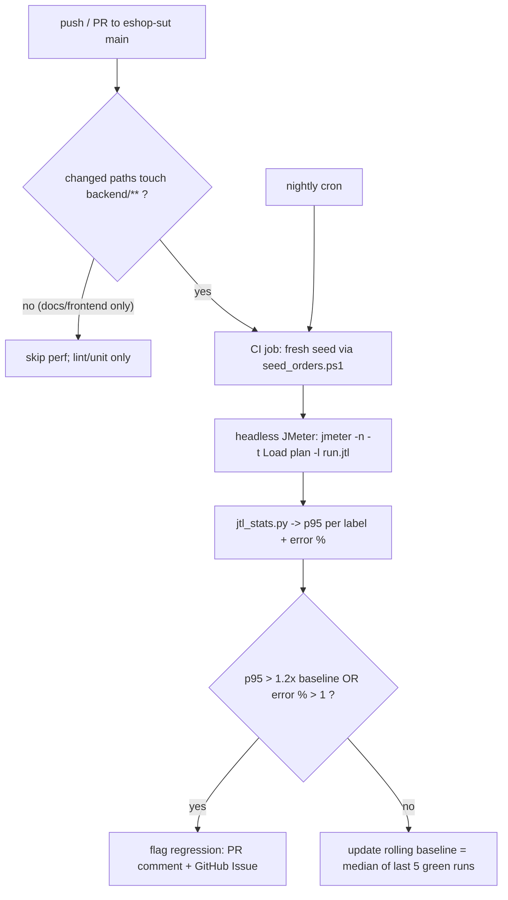

# MAIN REPORT

> **Môn học:** Kiểm thử phần mềm (Software Testing) — HW05: Performance Testing   
> **Sinh viên thực hiện:** Lưu Huy Hoàng    
> **Mã số sinh viên (MSSV):** 23127047  
> **Hệ thống thử nghiệm (SUT):** EShop E-commerce Platform — Backend API `http://localhost:3000` (single-process Node/Express 5 + SQLite, chạy cùng máy)  
> **Công cụ kiểm thử hiệu năng:** JMeter 5.6.3 + Qoder AI (Agent Skills — perf kit 4 stage)  
> **Chiến lược kiểm thử:** AI-First kết hợp Human-in-the-loop Review · Ground-truth-first (số liệu thô luôn đi trước diễn giải của AI)

---

## I. TỔNG QUAN CHIẾN LƯỢC KIỂM THỬ HIỆU NĂNG

### 1.1. Mục tiêu và Phạm vi

Bài tập HW05 kiểm thử hiệu năng backend API của SUT qua **Workflow 4 — Admin Order Fulfillment** (phân công nhóm; cam kết không trùng workflow với thành viên khác). Mục tiêu: đo sức chịu tải của DB khi admin liệt kê, xem chi tiết và chuyển trạng thái nhiều đơn hàng đồng thời.

Workflow end-to-end mỗi virtual user, phủ đủ 3 nhóm endpoint theo yêu cầu đề bài:

| # | Nhóm | Endpoint | Method | Vai trò trong workflow |
|---|---|---|---|---|
| 1 | Auth-heavy | `/api/login` | POST | Đăng nhập `admin@eshop.com` → JWT (mỗi iteration đăng nhập lại: chi phí phát hành JWT + bộ đếm lockout dưới concurrency) |
| 2 | Read-heavy | `/api/admin/orders` | GET | Admin liệt kê toàn bộ đơn hàng (full scan + JOIN + ORDER BY, payload ~64 KB) |
| 3 | Read-heavy | `/api/orders/:id` | GET | Xem chi tiết một đơn (id từ CSV) |
| 4 | Transactional | `/api/admin/orders/:id/status` | PUT | Chuyển trạng thái `pending → confirmed` (đường ghi có validation — state machine một chiều) |

Nguồn đặc tả: `kb/spec.md` + `kb/api_specification.md`; **từng endpoint được probe trực tiếp trên SUT thật ngày 2026-08-30** (script [`probe_workflow.ps1`](jmeter/scripts/probe_workflow.ps1)) trước khi thiết kế plan. Mọi lệch pha kb ↔ live được giữ nguyên và báo cáo là bug candidate (§III.4), không sửa kb.

### 1.2. Kiến trúc giải pháp (Test Architecture)

- **Data-driven bằng CSV (yêu cầu đề bài):**
  - [`users.csv`](jmeter/data/users.csv) — 1 dòng credential admin hợp lệ duy nhất, `recycle=true`.
  - [`orders.csv`](jmeter/data/orders.csv) — danh sách order id trạng thái `pending` thật trong DB, `recycle=false, stopThread=true, shareMode=all, ignoreFirstLine=true`: thread dừng thay vì đâm vào id đã bị tiêu thụ.
  - Vì state machine một chiều (pending→confirmed không quay lại được), script [`seed_orders.ps1`](jmeter/scripts/seed_orders.ps1) tạo đơn mới qua **luồng cart/checkout thật** rồi tự động re-export `orders.csv` — re-seed trước mỗi lần chạy chính thức (Load 150 / Stress 400 / Spike 100, luôn dư biên so với số PUT tiêu thụ 100/360/80).
- **Chuỗi phụ thuộc phiên:** JSON Post-Processor trích `$.token` từ login → HTTP Header Manager gắn `Authorization: Bearer ${token}` cho 3 request sau; order id lấy từ CSV theo dòng.
- **Assertions:** login có assertion kép (HTTP 200 + body chứa `"token"`) để lockout FR-02 (3 lần sai → khóa 30 s) lộ diện ngay trong kết quả; các request còn lại assert HTTP 200.
- **Think time:** Constant Timer 800 ms mọi plan — nhịp thao tác admin thực tế (~3,3 s/iteration).
- **Ba loại listener khác nhau trên ba plan (R4):** Aggregate Report (Load) · Summary Report (Stress) · View Results Tree (Spike). Mỗi listener ghi `.jtl` riêng về `jmeter/results/<Scenario>/result.jtl`.
- **Đặt tên file theo quy ước (R2):** `23127047_{Load,Stress,Spike}_20260830.jmx` — ba plan giống hệt nhau về workflow, **chỉ khác Thread Group + listener**.

### 1.3. Quy trình drive AI (perf kit — 3 stage, Agent Skill tự xây)

Bộ kit gồm 4 skill trong [`.agents/skills/`](.agents/skills/perf-on/SKILL.md): orchestrator `perf-on` điều phối `perf-design → perf-run → perf-analyze`. Mỗi stage có **human gate bắt buộc**, tiến độ theo dõi trong [`kit-state.md`](kit-state.md), và mỗi stage ghi một entry vào nhật ký [`audit/AI_Audit_Report.md`](audit/AI_Audit_Report.md) (7 entries):

| Stage | AI làm | Human làm |
|---|---|---|
| design | Map endpoint từ kb + probe live; sinh 3 plan `.jmx` + 2 CSV; tự rà checklist | Duyệt profile, sửa 3 lỗi AI (§III.1), chốt plan |
| run | Soạn quy trình seed + verify kết quả (jtl, HTML, screenshot, thread count) | Chạy GUI, chụp screenshot tool + resource cùng khung hình, re-seed trước mỗi run |
| analyze | Tính ground truth từ `.jtl` thô; diễn giải + đề xuất tối ưu | Săn misinterpretation, phán quyết từng đề xuất (§III.2–§III.3) |

---

## II. CHI TIẾT KẾT QUẢ THEO KỊCH BẢN

Mọi run thực thi trên JMeter GUI ngày 2026-08-30/31. Trước mỗi run: re-seed + một lần đăng nhập tay xác nhận tài khoản không bị khóa. **Không lần nào lockout bị kích hoạt** (chỉ một dòng credential đúng; assertion nội dung login sẽ phô bày mọi cơn bão 401).

Số liệu dưới đây trích trực tiếp từ `.jtl` thô bằng [`jtl_stats.py`](.agents/skills/perf-analyze/scripts/jtl_stats.py) — đây là ground truth, không chỉnh sửa sau khi AI phân tích.

**Hardware (hostname khớp các bài nộp trước):** DESKTOP-N7HAG7L — Dell OptiPlex 7040 · i7-6700 @ 3.40 GHz (8 logical) · 32 GB RAM · Win10 Pro 64-bit Build 19045 — bằng chứng [`hardware_evidence.png`](jmeter/results/hardware/hardware_evidence.png).

### 2.1. Load — 20 threads / 10 s ramp-up / 5 loops (~25 s)

Kế hoạch: [`23127047_Load_20260830.jmx`](jmeter/plans/23127047_Load_20260830.jmx) · Log: [`result.jtl`](jmeter/results/Load/result.jtl) + [`html_report`](jmeter/results/Load/html_report/index.html) · Ảnh: [`screenshots/`](jmeter/results/Load/screenshots/tool.png)

| label | samples | error % | avg ms | p95 ms | p99 ms | rps |
|---|---|---|---|---|---|---|
| 1-Login (admin) | 100 | 0.00 | 4 | 9 | 10 | 4.01 |
| 2-Admin order list | 100 | 0.00 | 7 | 16 | 18 | 4.01 |
| 3-Order detail | 100 | 0.00 | 2 | 5 | 6 | 4.01 |
| 4-Transition pending->confirmed | 100 | 0.00 | 12 | 19 | 22 | 4.01 |
| **OVERALL** | **400** | **0.00** | 6 | 17 | 20 | **16.03** |

**Đánh giá:** hệ thống giữ vững ở mức tải trung bình — 0% lỗi, p95 tổng 17 ms, đủ 20/20 thread. Đường ghi (PUT) chậm nhất (12 ms avg) đúng như dự đoán cho thao tác có validation + ghi SQLite.

### 2.2. Stress — 60 threads / 10 s ramp-up / 6 loops (~29 s)

Kế hoạch: [`23127047_Stress_20260830.jmx`](jmeter/plans/23127047_Stress_20260830.jmx) · Log: [`result.jtl`](jmeter/results/Stress/result.jtl) + [`html_report`](jmeter/results/Stress/html_report/index.html) · Ảnh: [`screenshots/`](jmeter/results/Stress/screenshots/tool.png)

| label | samples | error % | avg ms | p95 ms | p99 ms | rps |
|---|---|---|---|---|---|---|
| 1-Login (admin) | 360 | 0.00 | 16 | 46 | 330 | 12.53 |
| 2-Admin order list | 360 | 0.00 | 22 | 68 | 392 | 12.53 |
| 3-Order detail | 360 | 0.00 | 15 | 46 | 330 | 12.53 |
| 4-Transition pending->confirmed | 360 | 0.00 | 35 | 91 | 533 | 12.53 |
| **OVERALL** | **1440** | **0.00** | 22 | 60 | 428 | **50.12** |

**Đánh giá:** throughput scale gần tuyến tính (50.12 / 16.03 ≈ 3.1× cho 3× concurrency, đủ 60/60 thread) nhưng đây là vùng *knee*: p95 admin list tăng 4.25× (16→68 ms), PUT p95 91 ms, max latency 633 ms. Latency suy giảm rõ nhưng **không có lỗi nào** — hệ thống "chậm đi chứ chưa vỡ"; điểm gãy nằm ngoài 60 thread.

### 2.3. Spike — 80 threads / 1 s ramp-up / 1 loop (~3.5 s burst)

Kế hoạch: [`23127047_Spike_20260830.jmx`](jmeter/plans/23127047_Spike_20260830.jmx) · Log: [`result.jtl`](jmeter/results/Spike/result.jtl) + [`html_report`](jmeter/results/Spike/html_report/index.html) · Ảnh: [`screenshots/`](jmeter/results/Spike/screenshots/tool.png)

| label | samples | error % | avg ms | p95 ms | p99 ms | rps |
|---|---|---|---|---|---|---|
| 1-Login (admin) | 80 | 0.00 | 5 | 11 | 18 | 23.15 |
| 2-Admin order list | 80 | 0.00 | 11 | 27 | 31 | 23.15 |
| 3-Order detail | 80 | 0.00 | 5 | 16 | 25 | 23.15 |
| 4-Transition pending->confirmed | 80 | 0.00 | 19 | 43 | 45 | 23.15 |
| **OVERALL** | **320** | **0.00** | 10 | 29 | 45 | **92.62** |

**Đánh giá:** 80 admin ập vào trong 1 s, toàn bộ 320 request hoàn tất 0% lỗi trong 3.5 s (~92.6 RPS — đỉnh throughput đo được). Burst được hấp thụ trọn vẹn; spike ở đây là burst độc lập nên không đo "phục hồi" nối tiếp Stress (xem phân tích §III.2, claim #8).

### 2.4. Endurance threshold (soak 10 phút)

Chạy 10 phút ở tải duy trì (10 threads, đủ workflow, ~1.819 transition tiêu thụ); phân tích theo cửa sổ 1 phút bằng [`endurance_windows.py`](jmeter/scripts/endurance_windows.py). Báo cáo đầy đủ: [`report/endurance_threshold.md`](report/endurance_threshold.md) · Log: [`jmeter/results/Endurance/result.jtl`](jmeter/results/Endurance/result.jtl)

| Chỉ số | Kết quả |
|---|---|
| Throughput ổn định | **≈ 12.2 RPS** (12.10–12.28 qua 10 cửa sổ, ±1%) |
| Error rate | 0.00% toàn bộ 7.286 samples |
| p95 | Phẳng 22–29 ms, không suy giảm theo thời gian |
| Trần bộ nhớ backend | **≈ 71 MB** (baseline ~44 MB; PID backend xác định qua port 3000) |
| Điểm gãy | Không đạt tới ở mức tải này — giới hạn là CPU/SQLite, không phải RAM |

Ngưỡng kết luận: **RPS ổn định tối đa ≈ 12.2, trần bộ nhớ ≈ 71 MB** trên hardware này. Quan sát riêng: bộ nhớ backend tiếp tục tăng khi idle sau soak (71 → ~110 MB) — nghi vấn memory leak, ghi nhận ở §III.4.

> **Lưu ý diễn giải:** 0% lỗi nghĩa là *không có failure trong phạm vi tải đã test* — KHÔNG đồng nghĩa SUT không có vấn đề hiệu năng. Ba điểm yếu đo được vẫn được ghi nhận đầy đủ ở §III.4 (serialization đường ghi SQLite · admin list query không giới hạn + payload 63.7 KB không nén · memory tăng khi idle), và điểm gãy thật sự chưa được chạm tới vì không đẩy tải quá 80 thread.

---

## III. PHÂN TÍCH AI GAP & RÀ SOÁT BỞI CON NGƯỜI (HUMAN REVIEW & GAP ANALYSIS)

### 3.1. Lỗi của AI ở khâu thiết kế (Task 1 — human review)

| # | AI sai chỗ nào | Hậu quả nếu lọt | Human đã sửa | Vì sao AI bỏ sót |
|---|---|---|---|---|
| 1 | CSV Data Set Config sinh `ignoreFirstLine=false` dù có header + `variableNames` | Header bị ăn làm dữ liệu → ~50% login gửi `email=email` (401 giả), sinh request `/api/orders/order_id` rác | Đặt `ignoreFirstLine=true` cả 2 CSV; smoke run xác nhận 0% lỗi | Đặc thù endpoint (ngữ nghĩa CSV) + mô hình mặc định header luôn được bỏ qua |
| 2 | `orders.csv` sinh một lần lúc design rồi tái sử dụng, bất chấp state machine một chiều | Id đã confirmed → 400 "invalid transition" (đã thấy 50% PUT fail ở run kiểm chứng) | Seed script re-export CSV mỗi lần re-seed; re-seed trước mọi run chính thức | Mô hình không theo dõi vòng đời dữ liệu giữa các lần chạy |
| 3 | Stress sinh ramp 30 s / 3 loops — thread lifetime (~10 s) ngắn hơn ramp-up | Peak concurrency chỉ ~21/60 thread — "stress" đo dòng chảy nhỏ giọt | Ramp 10 s / loops 6 (lifetime ~20 s > ramp); verify 60/60 thread trong log | Cùng phép tính ramp-vs-lifetime AI từng sai ở Load; số template được tái dùng không tính lại |

### 3.2. Săn misinterpretation trong phân tích của AI (Task 2)

AI đọc 3 bảng ground truth và sinh diễn giải nguyên bản lưu tại [`report/analysis/ai_analysis_raw.md`](report/analysis/ai_analysis_raw.md) — không chỉnh sửa trong file đó; mọi đính chính nằm ở đây. Rà soát từng claim số liệu:

| # | Claim của AI | Verdict | Giá trị AI | Giá trị đúng | Bằng chứng |
|---|---|---|---|---|---|
| 1 | Load overall p95 ≈ 6 ms | ❌ | 6 ms | **17 ms** | Bảng Load OVERALL: avg=6, p95=17 |
| 2 | Login là endpoint nhanh nhất ở cả 3 kịch bản | ❌ | login nhanh nhất | Stress: detail 15 ms < login 16 ms (Load: detail 2 ms mới là nhanh nhất) | Bảng label Stress/Load |
| 3 | Stress là nơi hệ thống "began to break" | ⚠️ | đang vỡ | 0.00% lỗi ở mọi cửa sổ; chỉ latency phình (p95 46–91 ms) | Cột error % Stress |
| 4 | Mọi label đều ≥100 samples | ❌ | ≥100 | Spike chỉ 80 samples/label | Cột samples Spike |
| 5 | Stress ≈ 3.1× Load throughput | ✅ | 3.1× | 50.12/16.03 = 3.13× | Dòng OVERALL rps |
| 6 | Admin list p95 tứ tăng 16→68 ms | ✅ | 4× | 68/16 = 4.25× | Bảng Load/Stress |
| 7 | Spike 320 req / 3.5 s ≈ 92.6 RPS | ✅ | 92.6 | 92.62 | Dòng OVERALL Spike |
| 8 | Latency Spike "trở về mức Load" (phục hồi) | ⚠️ | = Load | Spike p95 11–43 ms — dưới Stress nhưng trên Load; đây là burst độc lập, không phải chuỗi phục hồi | Cột p95 Load vs Spike |

Ba lỗi ❌ điển hình:

- **#1** trích *average* (6 ms) làm p95 — nhầm lẫn avg/p95 kinh điển, đánh giá thấp tail risk 3×.
- **#2** ngoại suy thứ hạng từ một bảng sang mọi bảng mà không đọc lại.
- **#4** bịa bảo chứng "≥100 samples" tròn trịa trong khi Spike cố tình 80×1 theo thiết kế burst (báo cáo khai rõ thay vì giấu).

### 3.3. Phán quyết đề xuất tối ưu của AI (Task 2)

Trước khi phán quyết, stack được kiểm chứng trực tiếp trong repo SUT (`backend/package.json` + `database.js` + `server.js`): Express 5 + `sqlite3` + `jsonwebtoken`; **một** handle `sqlite3.Database()` duy nhất; **không** `PRAGMA journal_mode=WAL`; **không** `CREATE INDEX` nào; không thư viện pool/cache/compression. Query admin đã test: full scan + JOIN users + `ORDER BY id DESC` trên rowid PK, không filter status.

| # | Đề xuất | Verdict | Premise check (có thấy bottleneck trong số liệu CỦA MÌNH?) | Stack check (SUT thật có dùng công nghệ đó?) |
|---|---|---|---|---|
| 1 | Bật SQLite WAL | ✅ feasible | PUT p95 cao nhất dưới Stress (91 ms) — serialization writer/reader hiện rõ trong metrics | WAL không có trong database.js; sqlite3 hỗ trợ; đánh đúng đường ghi đã đo |
| 2 | Connection pool cho DB | ❌ hallucinated | Giả định connection DB là bottleneck scale ngang được | SQLite embedded single-file sau 1 handle; không pool library trong package.json; pooling là lời khuyên cho client–server DB — áp vào chỉ thêm contention |
| 3 | Index orders(status)/(user_id) | ⚠️ đúng nhưng không có cơ sở từ dữ liệu | Gap thật (DB không có index) nhưng query admin đã test là full scan + sort theo rowid PK, workflow này không filter status | Không cải thiện endpoint nào đã đo; chỉ query có filter trong tương lai hưởng lợi |
| 4 | gzip cho admin list | ✅ feasible | Đo trực tiếp từ cột `bytes` của .jtl: payload 63.7 KB/response — chi phí truyền tải là thật | Không middleware nén trong deps; thêm `compression` là one-liner; lợi băng thông, latency server chỉ giảm nhẹ |
| 5 | Cache admin list trong RAM | ⚠️ đúng nhưng không có cơ sở từ dữ liệu | Read-heavy đúng, nhưng 22–68 ms chấp nhận được; không metric nào đòi | Rủi ro stale với state machine + phức tạp invalidation vượt quá lợi ích ở mức latency này |

### 3.4. Bug / vấn đề ghi nhận được

**Vấn đề hiệu năng (performance issues):**

1. **Serialization đường ghi SQLite.** PUT status là endpoint nhạy tải nhất: p95 **91 ms** dưới Stress, tail p99 533 ms, max **633 ms** — request chậm nhất toàn project. Root cause kiểm chứng trong code: SQLite chạy rollback journal mặc định, không WAL, một DB handle duy nhất → writer chặn reader. Chính là đích của đề xuất WAL ✅ ở §3.3.
2. **Admin list query không giới hạn.** GET `/api/admin/orders` full scan + JOIN + ORDER BY trên *toàn bộ* đơn hàng, payload **63.7 KB** không nén, không index; p95 tứ tăng dưới Stress (16→68 ms) và sẽ thoái hóa tuyến tính khi bảng orders lớn dần — đạt ở dữ liệu cỡ môn học, là defect thật ở scale production.
3. **Memory tăng khi idle (nghi vấn leak).** Backend 44 → **71 MB** trong soak, rồi tiếp tục lên **~110 MB khi không có traffic** — bộ nhớ tăng không kèm tải là triệu chứng retention/leak; chưa kịp tác động latency trong cửa sổ 10 phút nên ghi nhận là observation, không phải failure đã đo.

**Bug chức năng / bảo mật (bug candidates từ §1.1):**

4. **FR-08 violation — chấp nhận `total_amount` do client gửi.** Checkout với `total_amount: 0` khi giỏ chứa món 30.000.000 ₫; đơn được lưu `total_amount = 0`. Spec: backend phải tự tính lại tổng tiền.
5. **SEC-01 — login response lộ bản ghi user đầy đủ** gồm `password` dạng plaintext (`"password":"Admin123!"`), `login_attempts`, `locked_until`.

### 3.5. Bài học lớn nhất

1. **Ground truth trước, diễn giải sau** — dán số liệu thô vào báo cáo trước khi hỏi AI, để AI không có cơ hội "bẻ" số.
2. **Không tin đề xuất tối ưu khi chưa mở repo** — 2/5 đề xuất (pool, cache) vô hại nếu làm theo nhưng sai bản chất stack; 1 đề xuất (index) đúng lý thuyết nhưng không giải quyết bottleneck đã đo.
3. **Human gate đặt ở chỗ đang PASS** — cả 3 lỗi design của AI đều không gây crash; chúng chỉ làm số liệu sai lệch một cách hợp lý (21/60 thread vẫn "chạy được").

---

## IV. ĐỀ XUẤT CONTINUOUS PERFORMANCE TESTING (TASK 3 — G9.6)

**Model.** Theo dõi commit của repo SUT; chỉ chạy test hiệu năng khi commit thực sự có thể đổi hiệu năng; so p95 với baseline lưu trữ và cờ regression ngay trong PR.

**Các quyết định thiết kế.** Path filter `backend/**` để không trả tiền cho commit không ảnh hưởng hiệu năng; nightly run bắt environment drift; baseline là trung vị trượt 5 run xanh (không phải 1 run) để hấp thụ nhiễu; state machine một chiều xử lý bằng re-seed trước mỗi CI run; thiết kế một credential giữ lockout ngoài CI.

**Trade-offs:**

- *Chi phí:* ~1 phút seed + ~30 s run cho mỗi commit backend trên agent chuyên dụng — rẻ với SUT cỡ môn học; đội thật sẽ container hóa SUT + generator để cách ly.
- *False alarm:* nhiễu phần cứng dùng chung (thermal throttle, AV scan) và trôi trạng thái SQLite có thể đội p95 — giảm bằng biên 1.2×, baseline trung vị trượt, và luật confirm-on-second-run trước khi mở Issue.
- *False negative:* chỉ chạy Load sẽ lọt regression đường ghi chỉ lộ ở 60 threads — nightly chạy luân phiên Load/Stress.

Pipeline tối ưu cho "không bao giờ ship regression p95 trong im lặng", đánh đổi bằng occasional re-run — xứng đáng cho SUT quy mô môn học.

---

